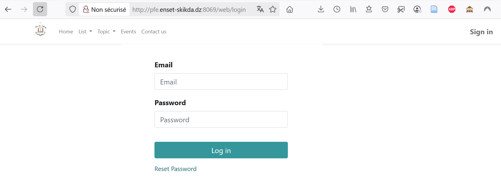
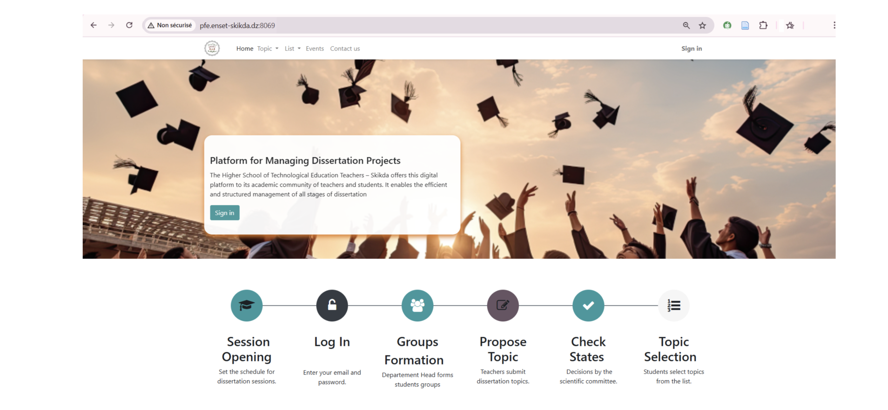
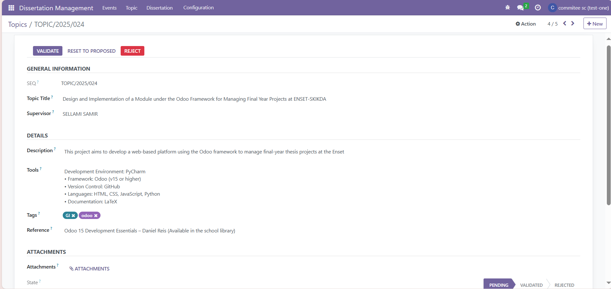
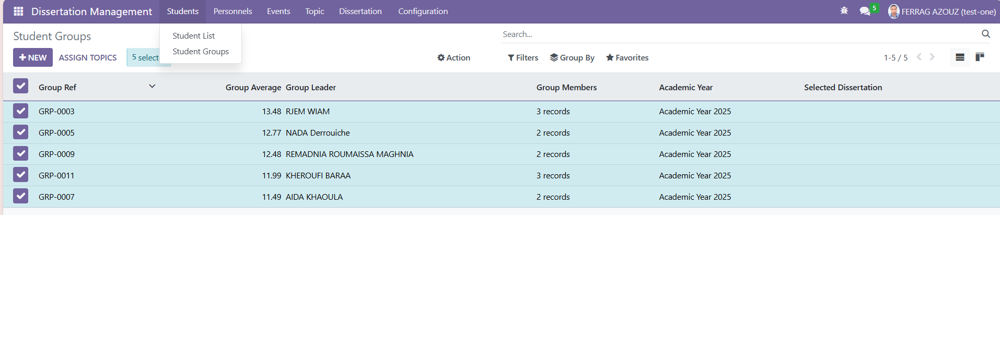
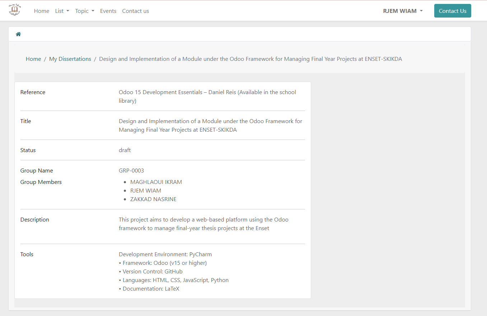
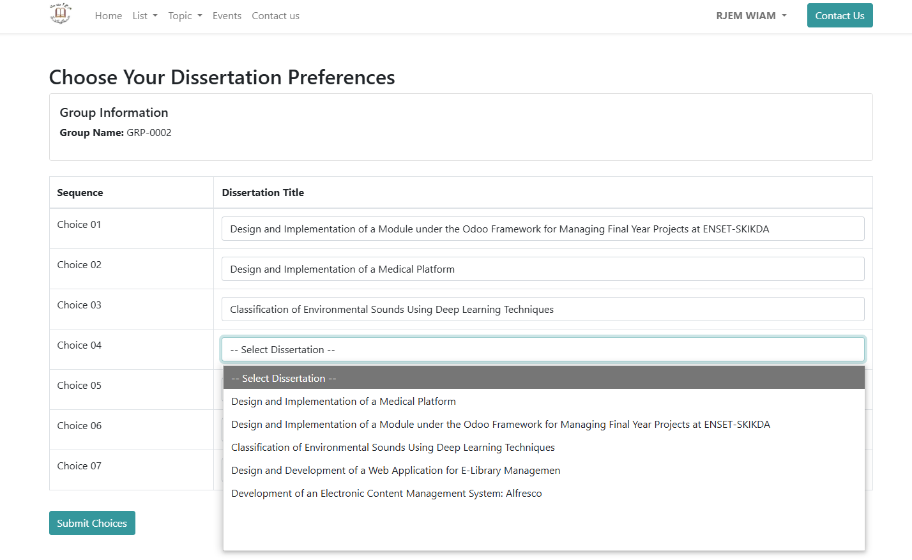
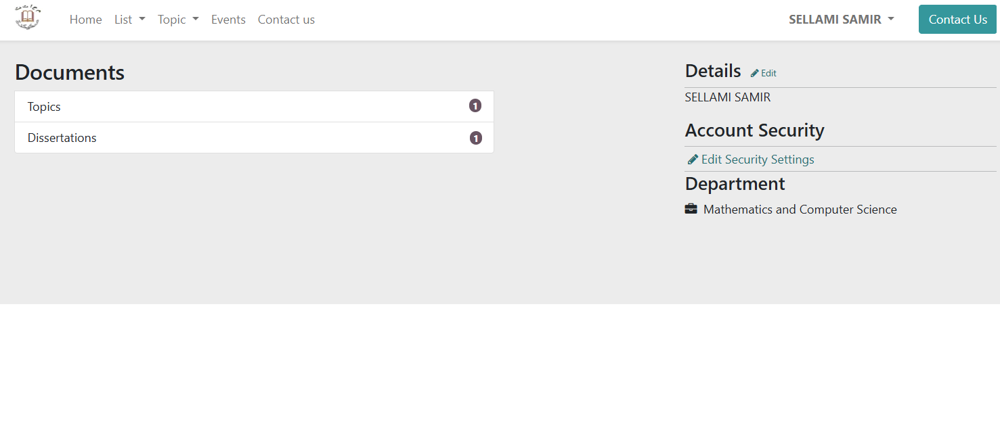
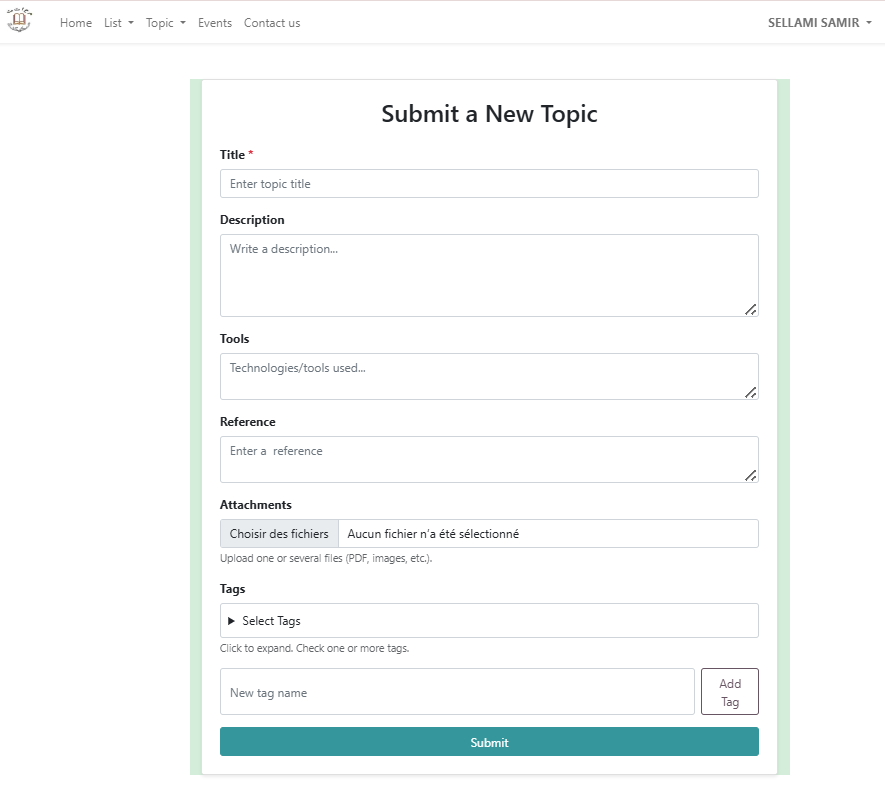

# PFE Management Module for Odoo 16 ― ENSET-Skikda

[](LICENSE) 

---

## Overview

Custom Odoo 16 add-on that digitises the entire lifecycle of final-year dissertations (PFE) for the Department of Mathematics & Computer Science, **ENSET-Skikda**.

---

## ✨ Key Features

* Role-based UIs for **Department Head, Scientific Committee, Teachers, Students and Jury**
* Topic proposal → validation → automatic assignment algorithm based on group GPA & preferences
* Student/Teacher web portals with real-time status tracking
* Jury evaluation workflow with aggregated scoring
* Internal messaging & email notifications
* Multi-level access control (ACL + record rules)
* Ready for i18n (English / Arabic)
* Deployed on-premise (Proxmox VM, Linux) inside the ENSET-Skikda IT service machines room

---

## 📸 Screenshot Gallery

| Login                                     | Landing Page                                    | Topic Validation                           | Dissertation Assignment                           |
| ----------------------------------------- | ----------------------------------------------- | ------------------------------------------ | ------------------------------------------------- |
|  |  |  |  |

| Student Portal                            | Topic Selection                                  | Teacher Portal                            | Topic Submission Form                  |
| ----------------------------------------- | ------------------------------------------------ | ----------------------------------------- | -------------------------------------- |
|  |  |  |  |

> *Only a subset of the UI is shown here; the full module contains additional views and wizards.*

---

## ⚡ Quick Start ― Installation on a vanilla **Odoo 16** instance

```bash
# 1. Pre-requisites
sudo apt install python3.8 python3.8-venv python3-dev build-essential \
                 postgresql wkhtmltopdf git

# 2. Clone repo into your custom-addons path
mkdir /opt/odoo_dev && cd /opt/odoo_dev
git clone https://github.com/<OWNER>/<REPO>.git
# resulting folder: /opt/odoo_dev/pfe

# 3. Virtual environment + Python deps
python3.8 -m venv venv
source venv/bin/activate
pip install wheel
pip install -r pfe/requirements.txt   # generated by Odoo

# 4. PostgreSQL database
sudo -u postgres createuser odoo -P           # choose a strong pwd
sudo -u postgres createdb pfe_db -O odoo

# 5. Run Odoo and install the module
~/odoo16/odoo-bin -c odoo.conf \
  --addons-path="~/odoo16/addons,/opt/odoo_dev" \
  -d pfe_db -i pfe
```

*Demo credentials (sample data)*

```
Department Head   admin@example.com / admin
Teacher           teacher@example.com / 1234
Student           student@example.com / 12345
```

---

## 🔧 Detailed Setup

| Area             | What to configure                                                            |
| ---------------- | ---------------------------------------------------------------------------- |
| **Email**        | Outgoing SMTP & incoming IMAP for notification engine                        |
| **Record rules** | Review `security/ir.model.access.csv` & XML rules if you introduce new roles |
| **Portal menus** | `views/*.xml` → adapt branding or hide menus                                 |
| **Website URL**  | Update website settings for production domain                                |

---

## 🚀 Architecture / Deployment

The solution is hosted **on-premise** inside the ENSET-Skikda IT-service machines room:

```
Proxmox VE  ➜  VM (Ubuntu 20.04 LTS)
            ➜  PostgreSQL 14
            ➜  Odoo 16 Community + pfe add-on
            ➜  Nginx reverse proxy  (HTTPS termination)
```

A nightly snapshot schedule on Proxmox plus PostgreSQL WAL archiving provides backup & recovery.

---

## 🕹️ Usage Guide

| Role                     | Backend | Portal | Key actions                                                  |
| ------------------------ | ------- | ------ | ------------------------------------------------------------ |
| **Department Head**      | ✔️      | —      | Group announcement, topic assignment, defence schedule       |
| **Scientific Committee** | ✔️      | —      | Validate / reject topics, assign juries                      |
| **Teacher (Supervisor)** | —       | ✔️     | Propose topics, monitor assigned groups, score progress      |
| **Student**              | —       | ✔️     | View validated topics, rank preferences, upload dissertation |
| **Jury**                 | ✔️      | —      | Review dissertations, submit evaluation                      |

---

## 🤝 Development & Contribution

1. Fork → feature branch → PR.
2. Follow Odoo coding-guidelines (PEP-8 + XML 4-space indent).
3. Add/extend tests under `tests/`.
4. Run `pylint` and `black`.
5. Ensure CI workflow passes.

---

## 🗺️ Roadmap / TODO

* [ ] Full Arabic translation
* [ ] Automatic plagiarism check (Turnitin API)
* [ ] KPI dashboards (owl + chart.js)
* [ ] Docker Compose deployment recipe
* [ ] Replace hard-coded emails with queue-based notifications

---

## 🪪 License

This project is licensed under the **GNU GPL v3.0** – see the [LICENSE](LICENSE) file for details.

---

## 🙏 Acknowledgements

* ENSET-Skikda ― Department of Mathematics & Computer Science
* Odoo community & documentation
* Daniel Reis, *Odoo 15 Development Essentials*

> *For academic citation, please refer to the dissertation “Design and Implementation of a Module under the Odoo Framework for Managing Final Year Projects at ENSET-Skikda”, 2025.*
> 
**Ms. Maghlaoui Ikram**  
**Ms. Zakkad Nesrine**  
**Ms. Rjem Wiem**
&nbsp;

**Supervised by&nbsp;&nbsp;&nbsp;Dr. SELLAMI Samir**  
**Co-Supervisor&nbsp;&nbsp;&nbsp;Ms. TAIBI Sihem**

<!-- TODO: Add project logo once available -->
